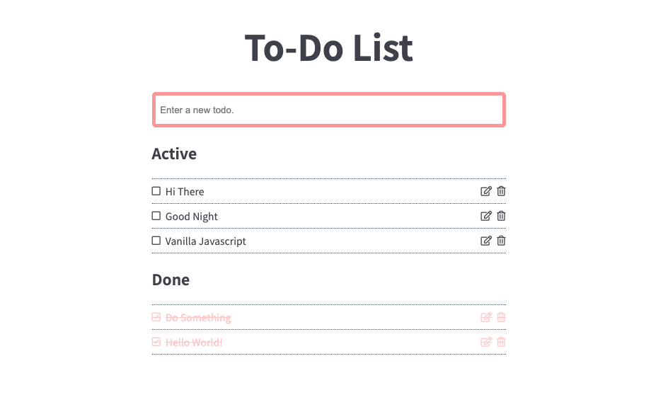
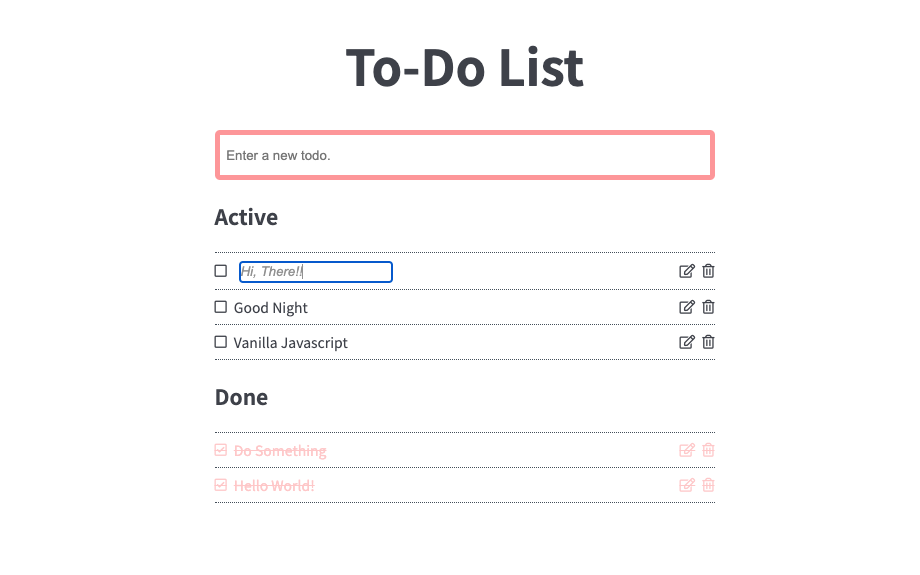

Vanilla (Pure) Javascript project for beginners.  
Check more projects [here](https://github.com/coachoox/vanilla-js-projects).

# To-Do List

Simple todo list made with Vanilla Javascript.  
[[Demo]](https://coachoox.github.io/js-todo-list/)  

## Preview

## Features

-   Add (Create)
-   Edit (Update)
-   Delete

## Copyrights & Reference

-   Font : [Noto Sans KR](https://fonts.google.com/specimen/Noto+Sans+KR?category=Sans+Serif&preview.text_type=custom)
-   [FontAwesome](https://fontawesome.com/)
